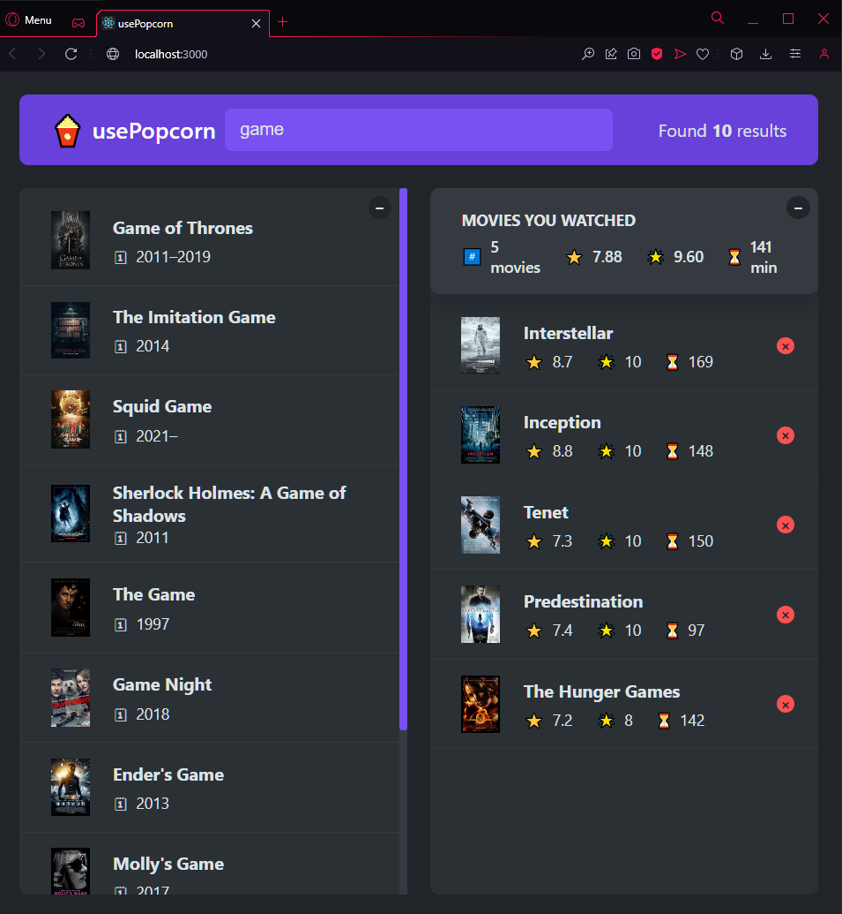

# 01| usePopcorn (v2)

## Pages

## Description

This projects includes:

- how to use the useEffect hook
- async function inside of useEffect hook
- how to fetch data from the omdb api
- how to make a loading state
- how to handle errors (mainly fetching errors)
- useEffect dependency array
- how to change the html title
- useEffect cleanup function
- abortController object
- how to handle javascript event listeners with useEffect

# Getting Started with Create React App

This project was bootstrapped with [Create React App](https://github.com/facebook/create-react-app).\
To install React go to the [Installation Page](https://react.dev/learn/installation)

## Available Scripts

In the project directory, you can run:

### `npm start`

Runs the app in the development mode.\
Open [http://localhost:3000](http://localhost:3000) to view it in your browser.

The page will reload when you make changes.\
You may also see any lint errors in the console.

### `npm test`

Launches the test runner in the interactive watch mode.\
See the section about [running tests](https://facebook.github.io/create-react-app/docs/running-tests) for more information.

## Learn More About React

You can learn more in the [Create React App documentation](https://facebook.github.io/create-react-app/docs/getting-started).

To learn React, check out the [React documentation](https://reactjs.org/).
