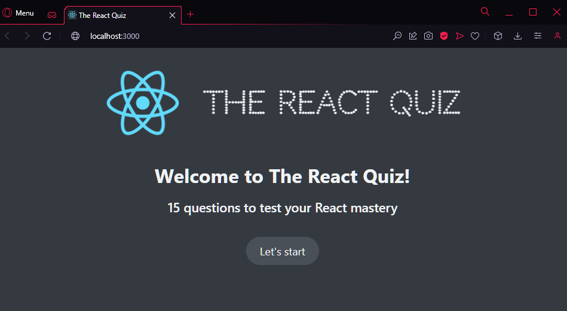
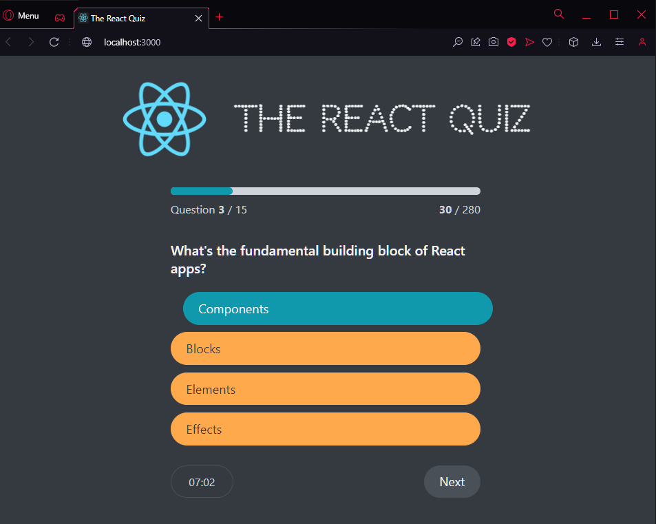
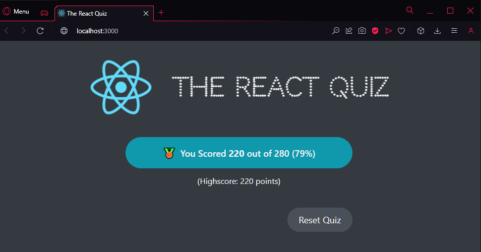

# 3| Context React Quiz

## Pages

### start screen

### question

### finish screen

## Description

This challenge includes modifying the [React Quiz](../../Course%20Projects/1-react-quiz/README.md)

- building a custom context: QuizContext
- refactoring the code of the React Quiz project to use the useQuiz hook instead of props
- fixing a small prop drilling issue

## Getting Started with Create React App

This project was bootstrapped with [Create React App](https://github.com/facebook/create-react-app).

### Available Scripts

In the project directory, you can run:

#### `npm start`

Runs the app in the development mode.\
Open [http://localhost:3000](http://localhost:3000) to view it in your browser.

The page will reload when you make changes.\
You may also see any lint errors in the console.

#### `npm test`

Launches the test runner in the interactive watch mode.\
See the section about [running tests](https://facebook.github.io/create-react-app/docs/running-tests) for more information.

### Learn More

You can learn more in the [Create React App documentation](https://facebook.github.io/create-react-app/docs/getting-started).

To learn React, check out the [React documentation](https://reactjs.org/).
