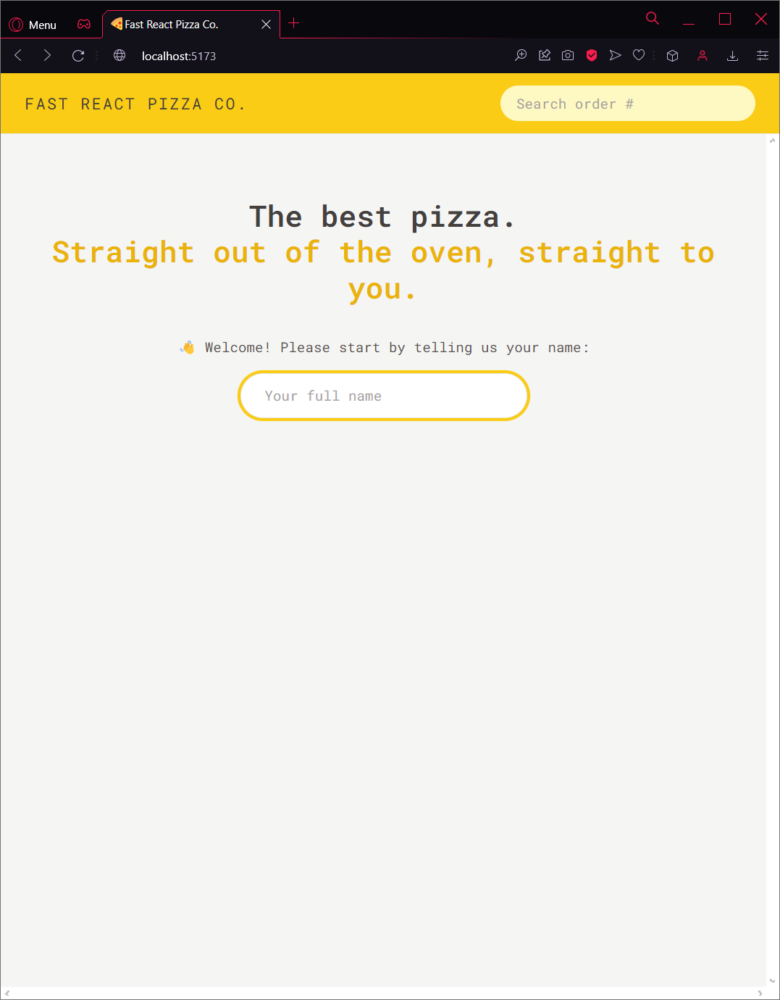

# 01| Fast React Pizza (v2)

## Pages

### Homepage

### Menu

### Cart

#### Cart

#### Empty Cart

### Order

#### New Order

#### Overview Order

##### Without priority

##### With Priority

## Description

This project uses the Vite tool. Inside the code you can find implemented functionality for [v1](../v1):

- modeling the user state with redux toolkit
- reading and updating the user state
- modeling the cart state
- adding menu items to the cart
- building the cart overview with redux selectors
- building the cart page
- building all cart functionality (adding, deleting, and updating quantities of cart items)
- redux thunks with createAsyncThunk
- integrating geolocation to help the user get his address easily
- fetching and updating data with useFetcher

# React + Vite

This template provides a minimal setup to get React working in Vite with HMR and some ESLint rules.

Currently, two official plugins are available:

- [@vitejs/plugin-react](https://github.com/vitejs/vite-plugin-react/blob/main/packages/plugin-react/README.md) uses [Babel](https://babeljs.io/) for Fast Refresh
- [@vitejs/plugin-react-swc](https://github.com/vitejs/vite-plugin-react-swc) uses [SWC](https://swc.rs/) for Fast Refresh

## Available Scripts

In the project directory, you can run:

### `npm run dev`

Runs the app in the development mode.\
Open [http://localhost:5173](http://localhost:5173) to view it in your browser.

The page will reload when you make changes.\
Lint errors are displayed in the page and you may also see them in the console.

### `npm run server`

Runs a fake api of a local .json file

## Installation

### `npm create vite@4`

Install all related Vite files (version 4)

### `npm i eslint vite-plugin-eslint eslint-config-react-app --save-dev`

Install a plugin to make eslint compatible with Vite

- add `eslint()` to the plugin array at [vite.config.js](vite.config.js)
- modify the rules at [.eslintrc.cjs](.eslintrc.cjs) as you wish

### `npm i json-server`

Install server files to use fake api from local .json files

Make sure to add the following line in the [package.json](package.json) inside the _"scripts"_ object:

- `"server": "json-server --watch data/cities.json --port 8000 --delay 500"`

If `--delay 500` doesn't work, modify the version of `json-server` inside the _"dependencies"_ object:

- `"json-server": "^0.17.3"`,

### `npm i react-router-dom@6`

Install the **Route** library (version 6)
