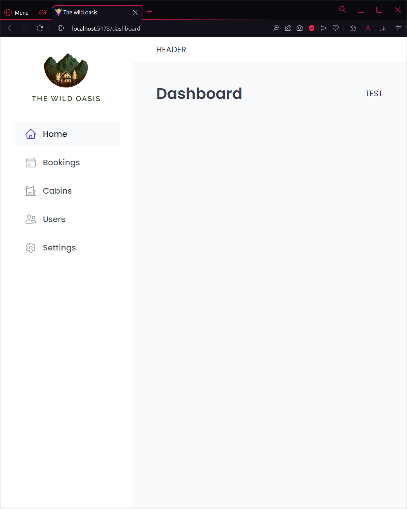

# 02| The Wild Oasis (v1)

## Pages

### Dashboard

### Bookings

### Cabins

### Users

### Settings

## Description

This project uses the Vite tool, React Router and Styled-Components libraries, and includes:

- Introduction to styled components
- Global styles with styled components
- Styled components props and 'css' function
- Building reusable style components
- Setting up pages and routes
- Building the App Layout
- Building the sidebar and main navigation

# React + Vite

This template provides a minimal setup to get React working in Vite with HMR and some ESLint rules.

Currently, two official plugins are available:

- [@vitejs/plugin-react](https://github.com/vitejs/vite-plugin-react/blob/main/packages/plugin-react/README.md) uses [Babel](https://babeljs.io/) for Fast Refresh
- [@vitejs/plugin-react-swc](https://github.com/vitejs/vite-plugin-react-swc) uses [SWC](https://swc.rs/) for Fast Refresh

## Available Scripts

In the project directory, you can run:

### `npm run dev`

Runs the app in the development mode.\
Open [http://localhost:5173](http://localhost:5173) to view it in your browser.

The page will reload when you make changes.\
Lint errors are displayed in the page and you may also see them in the console.

## Installation

### `npm create vite@4`

Install all related Vite files (version 4)

### `npm i eslint vite-plugin-eslint eslint-config-react-app --save-dev`

Install a plugin to make eslint compatible with Vite

- modify the rules at [.eslintrc.cjs](.eslintrc.cjs) as you wish

### `npm i react-router-dom@6`

Install the **Route** library (version 6)
